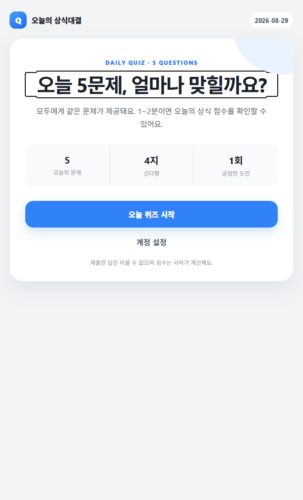
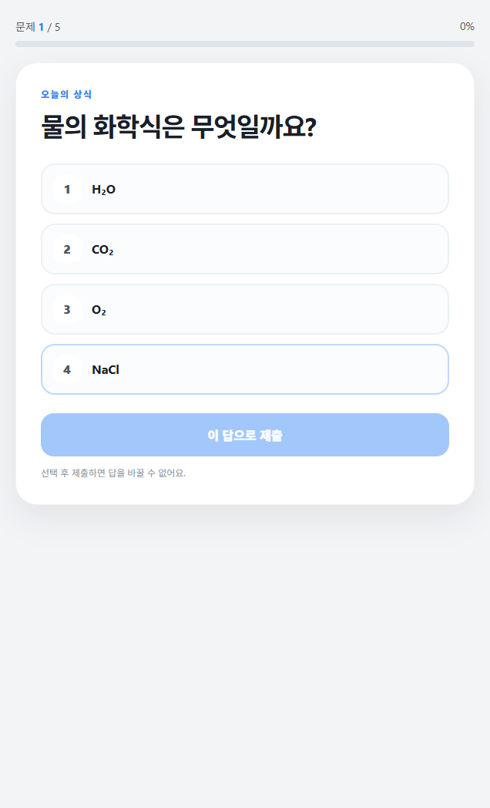
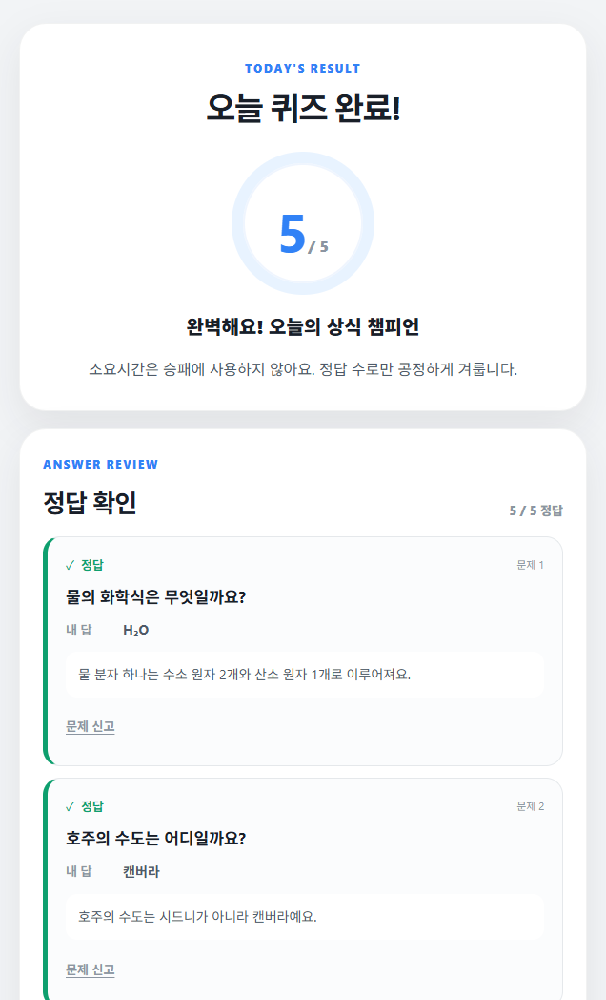

  

# 오늘의 상식대결

**매일 같은 5문제, 친구와 비교하는 오늘의 상식 점수.**

앱인토스에서 즐기는 하루 5문제 상식 퀴즈 앱입니다. 
퀴즈를 풀고 해설을 읽으며, 친구에게 같은 문제로 도전할 수 있어요.

[화면 미리보기](#화면-미리보기) · [주요 기능](#주요-기능) · [이용 방법](#이용-방법) · [문의](#문의)

> 현재 출시 준비 중입니다. 아래는 구현된 기능 소개이며, 공개 서비스 이용은 아직 제공하지 않습니다.

## 어떤 앱인가요?

오늘의 상식대결은 짧은 퀴즈 풀이를 친구와 함께 즐길 수 있는 앱입니다.
모두에게 같은 오늘의 문제를 제공하고, 완료한 뒤에는 점수뿐 아니라 정답과 해설까지 확인할 수 있어요.
친구와의 대결은 같은 문제의 정답 수를 비교하며, 풀이 속도는 승패에 사용하지 않습니다.

## 화면 미리보기

<table>
  <thead>
    <tr>
      <th>오늘의 퀴즈</th>
      <th>문제 풀이</th>
      <th>결과와 해설</th>
    </tr>
  </thead>
  <tbody>
    <tr>
      <td></td>
      <td></td>
      <td></td>
    </tr>
    <tr>
      <td>오늘의 5문제를 시작해요.</td>
      <td>보기를 선택해 순서대로 풀어요.</td>
      <td>점수와 정답·해설을 확인해요.</td>
    </tr>
  </tbody>
</table>

_개발 중인 앱을 로컬 테스트 데이터로 실행해 촬영한 화면입니다. 출시 화면은 달라질 수 있습니다._

## 앱의 특징

### 부담 없는 하루 5문제

네 가지 보기 중 답을 고르는 상식 퀴즈입니다.
오늘의 문제를 순서대로 풀며 다양한 주제의 상식을 확인해요.

### 같은 문제로 비교하는 친구 대결

도전 링크를 공유하면 친구도 같은 문제에 참여할 수 있어요.
서로 다른 문제나 풀이 속도가 아니라, 같은 문제에서 맞힌 개수로 결과를 비교합니다.

### 점수에서 끝나지 않는 정답·해설

완료하면 5점 만점의 점수와 문제별 정답·해설을 확인할 수 있어요.
틀린 문제도 해설을 읽고 새로운 상식을 알아가는 기회로 삼을 수 있습니다.

### 중단해도 이어서 풀기

선택한 답은 같은 기기의 저장 공간에 임시 보관하며, 최종 제출 전에는 바꿀 수 있어요.
5문제의 답을 한 번에 서버에 제출한 뒤 점수와 해설을 확인합니다.
임시 답안은 다른 기기에 동기화되지 않으며 저장 공간을 지우면 복구할 수 없습니다.
최종 제출 중에는 답을 바꿀 수 없고, 응답이 불확실하면 같은 답안으로 재시도합니다.
이전 방식으로 이미 서버에 저장된 답은 변경하지 않습니다.

## 주요 기능

| 기능        | 설명                                            |
| ----------- | ----------------------------------------------- |
| 오늘의 퀴즈 | 매일 같은 4지선다형 상식 5문제 풀이             |
| 이어 풀기   | 같은 기기의 임시 답안 복구 및 최종 제출 재시도  |
| 결과·해설   | 서버 채점 점수와 문제별 정답·해설 확인          |
| 친구 대결   | 도전 링크 생성·참여와 결과 비교                 |
| 문제 신고   | 문제나 해설에 오류가 있을 때 신고               |
| 계정 관리   | 앱 내 계정 삭제 요청과 관련 개인 기록 삭제 처리 |

## 이용 방법

1. **오늘 퀴즈 시작** — 홈에서 오늘의 5문제를 시작합니다.
2. **답 선택·확인** — 네 가지 보기 중 하나를 고르고, 이전 문제로 돌아가 수정할 수 있습니다.
3. **최종 제출·결과 확인** — 답 5개를 한 번에 제출하고 서버 저장·채점 후 해설을 확인합니다.
4. **친구에게 도전** — 기능이 활성화된 경우 도전 링크를 공유하고 같은 문제의 결과를 비교합니다.

비공개 기기 테스트용 빌드는 `VITE_PRIVATE_TEST_DEPLOYMENT_ID`에 이미 업로드한
호환 버전의 배포 ID를 지정합니다. 이 경우 정식 출시 링크 대신 해당 비공개 버전의
도전 경로를 공유합니다. 받는 사람도 토스 비공개 테스트 접근 조건을 충족해야 하며,
같은 계정은 자신의 도전에 참여할 수 없습니다. 정식 출시 빌드에는 이 값을 지정하지 않습니다.

## 기술 구성

| 영역        | 구성                      |
| ----------- | ------------------------- |
| 앱 화면     | React · TypeScript · Vite |
| 실행 플랫폼 | 앱인토스 Web Framework    |
| 서버 API    | Node.js · Fastify         |
| 데이터 저장 | PostgreSQL                |
| 요청 제한   | Redis                     |
| 데이터 계약 | TypeScript · Zod          |

## 문의

문제 내용의 오류는 앱의 **문제 신고** 기능을 통해 알려주세요.
서비스 관련 문의는 [leedonghwiid00@gmail.com](mailto:leedonghwiid00@gmail.com)으로 보내주세요.

문의에 비밀번호, 인증번호, 개인키 등 민감한 정보를 포함하지 마세요.
